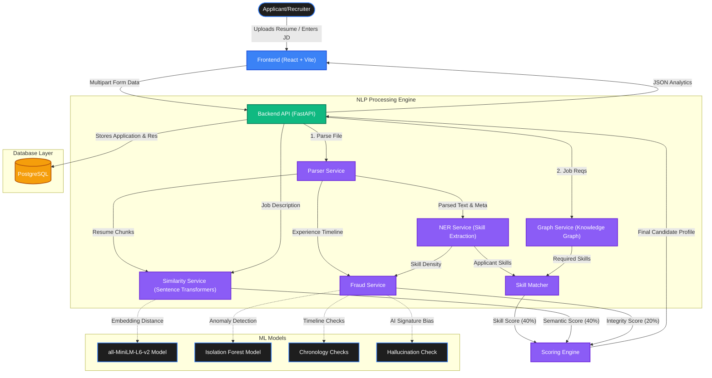

# Aira ATS 🚀

Aira is an advanced Applicant Tracking System (ATS) powered by state-of-the-art NLP, Machine Learning, and Knowledge Graphs. Designed to intelligently analyze resumes against job descriptions, Aira goes beyond keyword matching by using semantic search and advanced fraud detection to ensure candidate authenticity and skill alignment.

---

## 🌟 Key Features

- **Semantic Match Engine:** Instead of just checking keywords, Aira understands context. Using `SentenceTransformers` (`all-MiniLM-L6-v2`), it calculates embedding similarities between the job description and the chunks of the resume.
- **Skill Knowledge Graph:** Maps job titles and requirements dynamically to ensure we look for the right dependencies and technologies.
- **Advanced Fraud & Integrity Detection:**
  - **Timeline Consistency:** Detects chronological anomalies (e.g., impossible overlaps or severe gaps).
  - **AI Hallucination Checks:** Spots language heuristics and "burstiness" indicative of LLM-generated templates.
  - **Isolation Forest Modeling:** Flags candidate profiles if their buzzwords, redundancy, and fluff indicate padding.
- **Automated Skill Extraction (NER):** Extracts technologies, tools, and paradigms from unstructured resume text.
- **Holistic Scoring:** Candidates are evaluated on a blended scale:
  - 40% Keyword & Skill Match
  - 40% Semantic Similarity Match
  - 20% Integrity / Fraud Check

---

## 🏗️ System Architecture



---

## 🛠️ Technology Stack

### Frontend
- **React.js 19**
- **Vite** - Dev Server & Bundling
- **Tailwind CSS 4** - Styling
- **Framer Motion** - Animations

### Backend (API)
- **FastAPI** - High-performance asynchronous API
- **Python 3.10+** - Core language

### Machine Learning & NLP
- **scikit-learn** - Isolation Forests for anomaly detection
- **Sentence-Transformers** - BGE-M3 & MiniLM encodings for robust semantic scoring
- **Graph Service** - Traverses taxonomy of skills
- **Pandas / NumPy** - Matrix & Array configurations

### Database & Infra
- **PostgreSQL 15** - Relational data persistence
- **Docker Compose** - Orchestration for containers

---

## 🚀 Getting Started

### Prerequisites
- Docker & Docker Compose
- Node.js (for frontend local dev)
- Python 3.10+ (for backend local dev)

### 1. Start the Database
From the root directory, spin up PostgreSQL via Docker:
```bash
docker-compose up -d
```

### 2. Run the Backend Server
```bash
cd backend
python -m venv venv
source venv/bin/activate  # On Windows use: venv\Scripts\activate
pip install -r requirements.txt

uvicorn main:app --reload --port 8000
```
*Note: On the first run, `FraudService` might attempt to train itself based on `resume_data.csv` and `SimilarityService` will download the required huggingface sentence-transformer weights.*

### 3. Run the Frontend Applications
In a new terminal window:
```bash
cd frontend
npm install
npm run dev
```

Visit `http://localhost:5173` to access the Aira Recruiter Dashboard.

## 🤝 Contribution Highlights
- **Intelligent parsing**: Translating text logs and tables directly into structured objects.
- **Robust Fraud metrics**: Automatically penalizes AI-generated jargon, suspicious overlapping employment lengths, and meaningless buzzword drops giving recruiters true confidence in candidate integrity.
